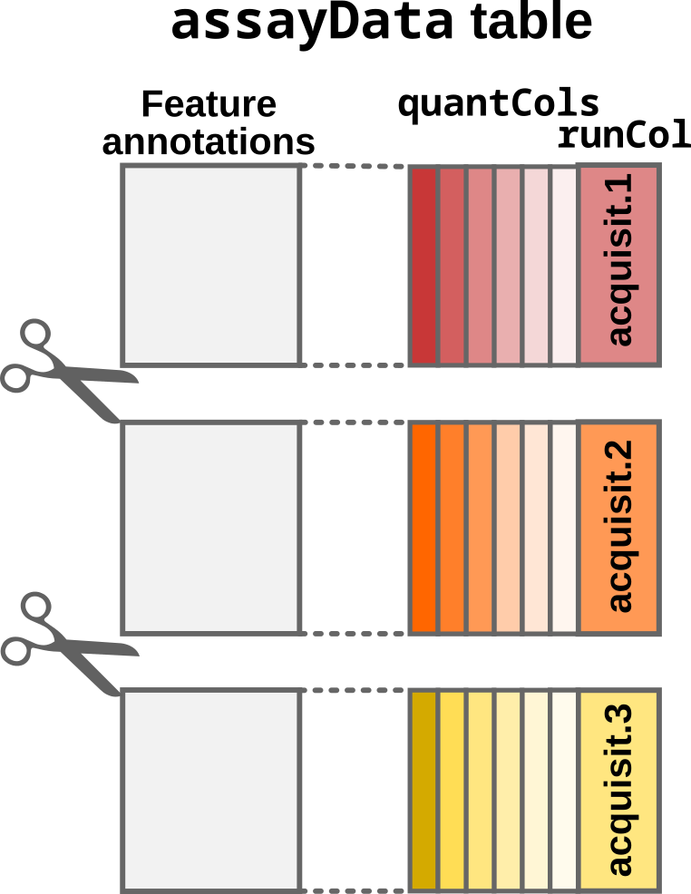
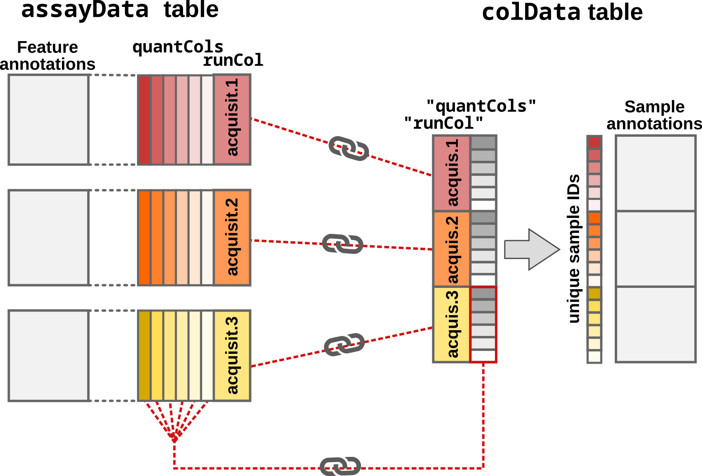
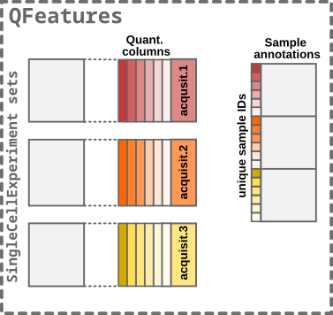

```{r setup, include = FALSE}
knitr::opts_chunk$set(
    collapse = TRUE,
    comment = "#>",
    crop = NULL
    ## cf to https://stat.ethz.ch/pipermail/bioc-devel/2020-April/016656.html
)
```

# The `scp` data framework

Our data structure is relying on two curated data classes: `QFeatures`
(@Gatto2023-ry) and `SingleCellExperiment` (@Amezquita2019-bf).
`QFeatures` is dedicated to the manipulation and processing of
MS-based quantitative data. It explicitly records the successive steps
to allow users to navigate up and down the different MS levels.
`SingleCellExperiment` is another class designed as an efficient data
container that serves as an interface to state-of-the-art methods and
algorithms for single-cell data. Our framework combines the two
classes to inherit from their respective advantages.

Because mass spectrometry (MS)-based single-cell proteomics (SCP) only
captures the proteome of between one and a few tens of single-cells in
a single run, the data is usually acquired across many MS batches.
Therefore, the data for each run should conceptually be stored in its
own container, that we here call a *set*. The expected input for
working with the `scp` package is quantification data of peptide to
spectrum matches (PSM). These data can then be processed to reconstruct
peptide and protein data. The links between related features across
different sets are stored to facilitate manipulation and
visualization of of PSM, peptide and protein data. This is
conceptually shown below.

```{r, fig.cap="The `scp` framework relies on `SingleCellExperiment` and `QFeatures` objects", echo=FALSE, out.width='100%', fig.align='center'}
knitr::include_graphics("./figures/SCP_framework.png")
```

The main input table required for starting an analysis with `scp` is 
called the `assayData`.

# `assayData` table

The `assayData` table is generated after the identification and
quantification of the MS spectra by a pre-processing software such as
MaxQuant, ProteomeDiscoverer or MSFragger (the
[list](https://en.wikipedia.org/wiki/List_of_mass_spectrometry_software)
of available software is actually much longer). We will here use as an
example a data table that has been generated by MaxQuant. The table is
available from the `scp` package and is called `mqScpData` (for
MaxQuant generated SCP data).

```{r, message = FALSE}
library(scp)
data("mqScpData")
dim(mqScpData)
```

In this toy example, there are 1361 rows corresponding to features
(quantified PSMs) and 149 columns corresponding to different data
fields recorded by MaxQuant during the processing of the MS spectra.
There are three types of columns:

- Quantification columns (`quantCols`): 1 to n (depending on technology)
- Run identifier column (`runCol`): *e.g.* file name
- Feature annotations: *e.g.* peptide sequence, ion charge, protein name

```{r, echo=FALSE, out.width="450px", fig.cap="Conceptual representation of the `assayData` input table", fig.align = 'center'}
knitr::include_graphics('figures/readSCP_inputTable.png')
```

### Quantification columns (`quantCols`)

The quantification data can be composed of one (in case of label-free
acquisition) or multiple columns (in case of multiplexing). In the
example data set, the columns holding the quantification, the 
`quantCols`, start with `Reporter.intensity.` followed by a number.

```{r}
(quantCols <- grep("Reporter.intensity.\\d", colnames(mqScpData),
                  value = TRUE))
```

As you may notice, the example data was acquired using a TMT-16
protocol since we retrieve 16 quantification columns. Actually, some
runs were acquired using a TMT-11 protocol (11 labels) but we will
come back to this later.

```{r}
head(mqScpData[, quantCols])
```

### Run identifier column (`runCol`)

This column provides the identifier of the MS runs in which each PSM 
was acquired. MaxQuant uses the raw file name to identify the run.

```{r}
unique(mqScpData$Raw.file)
```

### Feature annotations

The remaining columns in the `mqScpData` table contain information used
or generated during the identification of the MS spectra. For instance,
you may find the charge of the parent ion, the score and probability
of a correct match between the MS spectrum and a peptide sequence, the
sequence of the best matching peptide, its length, its modifications,
the retention time of the peptide on the LC, the protein(s) the peptide
originates from and much more.

```{r}
head(mqScpData[, c("Charge", "Score", "PEP", "Sequence", "Length",
                   "Retention.time", "Proteins")])
```

# `colData` table

The `colData` table contains the experimental design generated by the
researcher. The rows of the sample table correspond to a sample in
the experiment and the columns correspond to the available annotations
about the sample. We will here use the second example table:

```{r}
data("sampleAnnotation")
head(sampleAnnotation)
```

The `colData` table may contain any information about the samples. For example,
useful information could be the type of sample that is analysed, a
phenotype known from the experimental design, the MS batch, the
acquisition date, MS settings used to acquire the sample, the LC
batch, the sample preparation batch, etc... However, `scp`
**requires** 2 specific columns in the `colData` table:

1. `runCol`: this column provides the MS run names (that match the 
   `Raw.file` column in the `assayData` table).
2. `quantCols`: this column tells `scp` the names of the columns in the feature
   data holds the quantification of the corresponding sample.

These two columns allow `scp` to correctly split and match data that
were acquired across multiple acquisition runs.

```{r echo=FALSE, out.width='450px', fig.cap="Conceptual representation of the sample table", fig.align = 'center'}

```

# `readSCP()`

`readSCP` is the function that converts the `assayData` and the 
`colData` into a `QFeatures` object following the data structure described
above, that is storing the data belonging to each MS batch in a
separate `SingleCellExperiment` object.

## Sample names

`readSCP()` automatically assigns names that are unique across all
samples in all sets. This is performed by appending the name of the
MS run where a given sample is found with the name of the
quantification column for that sample. Suppose a sample belongs to
batch `190222S_LCA9_X_FP94BM` and the quantification values in the
`assayData` table are found in the column called `Reporter.intensity.3`,
then the sample name will become
`190222S_LCA9_X_FP94BM_Reporter.intensity.3`.

## Special case: empty samples

In some rare cases, it can be beneficial to remove empty samples (all
quantifications are `NA`) from the sets. Such samples can occur when
samples that were acquired with different multiplexing labels are
merged in a single table. For instance, the SCoPE2 data we provide as
an example contains runs that were acquired with two TMT protocols.
The 3 first sets were acquired using the TMT-11 protocol and the
last set was acquired using a TMT-16 protocol. The missing label
channels in the TMT-11 data are filled with `NA`s. When setting
`removeEmptyCols = TRUE`, `readSCP` automatically detects and removes
columns containing only `NA`s,

## Running `readSCP`

We convert the sample and the feature data into a `QFeatures` object
in a single command thanks to `readSCP`.

```{r readSCP}
(scp <- readSCP(assayData = mqScpData,
               colData = sampleAnnotation,
               runCol = "Raw.file",
               removeEmptyCols = TRUE))
```

The object returned by `readSCP()` is a `QFeatures`
object containing 4 `SingleCellExperiment` sets that have been named
after the 4 MS batches. Each set contains either 11 or 16 columns
(samples) depending on the TMT labelling strategy and a variable
number of rows (quantified PSMs). Each piece of information can easily
be retrieved thanks to the `QFeatures` architectures.  As mentioned in
another
[vignette](https://uclouvain-cbio.github.io/scp/articles/QFeatures_nutshell.html),
the `colData` is retrieved using its dedicated function:

```{r colData}
head(colData(scp))
```

The feature annotations are retrieved from the `rowData`. Since the
feature annotations are specific to each set, we need to tell from
which set we want to get the `rowData`:

```{r rowData}
head(rowData(scp[["190222S_LCA9_X_FP94BM"]]))[, 1:5]
```

Finally, we can also retrieve the quantification matrix for a set
of interest:

```{r assay}
head(assay(scp, "190222S_LCA9_X_FP94BM"))
```

## Under the hood

`readSCP` proceeds as follows:

1. The `assayData` table must be provided as a `data.frame`. 
   `readSCP()` converts the table to a `SingleCellExperiment` object 
   but it needs to know which column(s) store the quantitative data.
   Those column name(s) is/are provided by the `quantCols`
   field in the annotation table (`colData` argument).

```{r echo=FALSE, out.width='450px', include=TRUE,fig.cap="Step1: Convert the input table to a `SingleCellExperiment` object", fig.align = 'center'}
knitr::include_graphics('figures/readSCP_step1.png')
```

2. The `SingleCellExperiment` object is then split according to the
   acquisition run. The split is performed depending on the `runCol`
   field in `assayData`. It is also indicated in the `runCol`
   argument. In this case, the data will be split according to the
   `Raw.file` column in `mqScpData`. `Raw.file` contains the names of
   the acquisition runs that was used by MaxQuant to retrieve the raw
   data files.

```{r echo=FALSE, out.width='500px', fig.cap="Step2: Split by acquisition run", fig.align = 'center'}

```

3. The sample annotations is generated from the supplied sample table
   (`colData` argument). Note that in order for `readSCP()` to
   correctly match the feature data with the annotations, `colData`
   must contain a `runCol` column with run names and a `quantCols` 
   column with the names of the quantitative columns in `assayData`.

```{r echo=FALSE, out.width='700px', fig.cap="Step3: Adding and matching the sample annotations", fig.align = 'center'}

```

4. Finally, the `SingleCellExperiment` sets and the `colData` are
   converted to a `QFeatures` object.

```{r echo=FALSE, out.width='600px', fig.cap="Step4: Converting to a `QFeatures`", fig.align = 'center'}

```

# What about label-free SCP?

The `scp` package is meant for both label-free and multiplexed SCP
data. Like in the example above, the label-free data should contain
the batch names in both the feature data and the sample data.  The
sample data must also contain a column that points to the columns of
the feature data that contains the quantifications. Since label-free
SCP acquires one single-cell per run, this sample data column should
point the same column for all samples. Moreover, this means that each
PSM set will contain a single column.

# What about other input formats?

`readSCP()` should work with any PSM quantification table that is
output by a pre-processing software. For instance, you can easily
import the PSM tables generated by ProteomeDiscoverer. The batch names
are contained in the `File ID` column (that should be supplied as the
`batchCol` argument to `readSCP()`). The quantification columns are
contained in the columns starting with `Abundance `, eventually
followed by a multiplexing tag name. These columns should be stored in
a dedicated column of the sample data to be supplied as `runCol`
to `readSCP()`.

If your input cannot be loaded using the procedure described in this
vignette, you can submit a feature request (see next section).

The `readSCPfromDIANN()` function is adapted to import label-free and
plexDIA/mTRAQ `Report.tsv` files generated by DIA-NN.

For more information, see the `readQFeatures()` and
`readQFeaturesFromDIANN()` manual pages, that described the main
principle that concern the data import and formatting.

# Need help?

You can open an issue on the [GitHub
repository](https://github.com/UCLouvain-CBIO/scp/issues) in case of
troubles when loading your SCP data with `readSCP()`. Any suggestion
or feature request about the function or the documentation are also
warmly welcome.

# Session information {-}

```{r setup2, include = FALSE}
knitr::opts_chunk$set(
    collapse = TRUE,
    comment = "",
    crop = NULL
)
```


```{r sessioninfo, echo=FALSE}
sessionInfo()
```

# License {-}

This vignette is distributed under a
[CC BY-SA license](https://creativecommons.org/licenses/by-sa/2.0/)
license.

# Reference {-}
