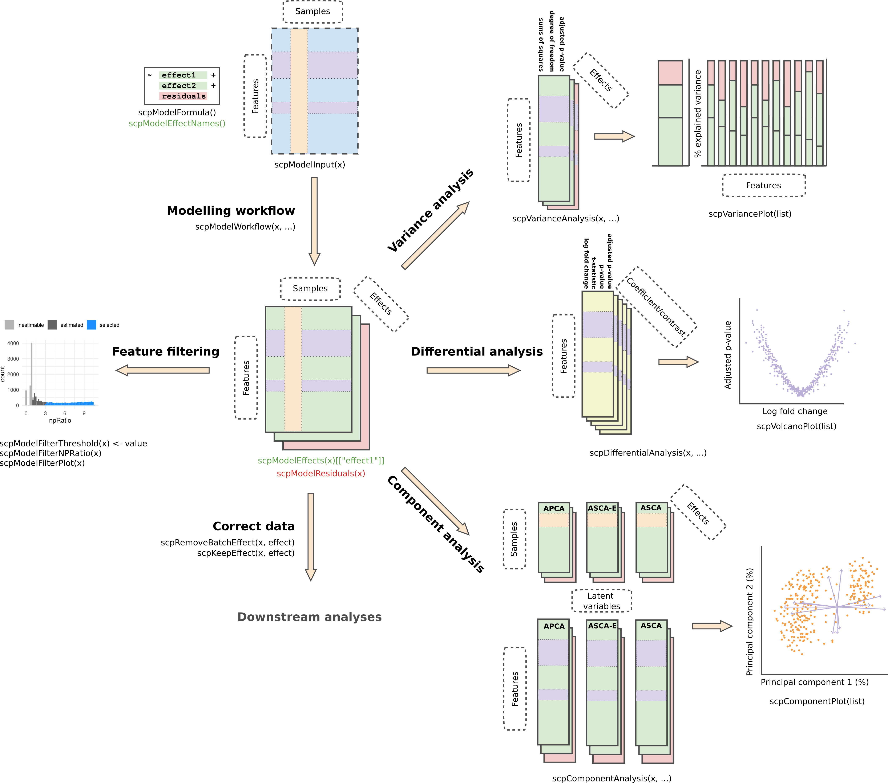

```{r setup, include = FALSE}
knitr::opts_chunk$set(
    collapse = TRUE,
    comment = "#>",
    crop = NULL
    ## cf https://stat.ethz.ch/pipermail/bioc-devel/2020-April/016656.html
)
```

# Introduction

In this tutorial, we'll walk you through the process of modelling
single-cell proteomics (SCP) data using the *scplainer* appreach
[@Vanderaa2023-scplainer]. By the end of this vignette, you will be
able to:

- Define and estimate a model suitable for SCP data
- Filter peptides based on the patterns of missing values
- Exploring the model output through analysis of variance
- Exploring the model output through differential abundance analysis
- Exploring the model output through component analysis
- Perform batch correction to remove unwanted technical artefacts

The last point will allow you to generate SCP data that is suitable
for downstream analysis, such as clustering or trajectory inference.
The figure below provides a roadmap of the workflow:



The vignette will start with the processed data extracted as a
`SingleCellExperiment` object from a processed `QFeatures` object. We
will not cover data processing as it is covered in another vignette.

```{r, message = FALSE}
library("scp")
library("SingleCellExperiment")
library("patchwork")
library("ggplot2")
```

# Example data set

The example data set is a subset of the `leduc2022_pSCoPE` data set
(see `?scpdata::leduc2022_pSCoPE` for more info). The data is acquired
using TMT-18 multiplexing and data-dependent acquisition (DDA). The
data has been processed using a minimal workflow:

- Any zero value has been replaced by NA.
- Any peptide was removed from the data set if it matched to a decoy or
  contaminant peptide, had low spectral purity, had low identification
  confidence, or had a high sample to carrier ratio.
- Any cell was removed from the data set if it had a high coefficient of
  variation, had an abberrant median intensity, or had few identified
  peptides.
- PSM data were combined into peptide data. When multiple PSM match to
  the same peptide, the median intensity was taken.
- Intensities were log2 transformed
- To limit intensive computation, we have limited the data set to 200
  peptides in 73 cells.

We suggest using this minimal processing workflow, although the
approach presented here is agnostic of previous processing and allows
for other custom workflows. The data processing was conducted with
`QFeatures` and `scp`.

```{r}
data("leduc_minimal")
leduc_minimal
```

The data set is formatted as a `SingleCellExperiment` object. The data
set consists of 200 peptides and 73 cells. Peptide annotations can be
retrieved from the `rowData` and cell annotations can be retrieved
from the `colData`. The cell annotation will be used during modelling.

# Data modelling

The core of the approach relies on statistical modelling of the data
using linear regression. Under the hood, the model fetches as
input the intensity matrix stored in `assay(leduc_minimal)`.
The cell annotations are retrieved using `colData(leduc_minimal)`.
They describe known technical and biological variables that may
influence the acquired peptide intensities. The annotations are used
to build a regression model with $p$ parameters. Then, the model
estimates the coefficients. Coefficients provide the contributions of
each parameter to the expression of each of peptide as well as the
uncertainty of the estimation. These will be explored in the following
section.

We'll start by defining the variables to include in the model. Recall
that the example data set contains TMT-labeled cells. This means that
each MS acquisition run contains multiple cells. Each run is subject
to technical fluctuations that can lead to undesired variation, this is
known as a batch effect.

```{r technical_variables1}
table(leduc_minimal$Set)
```

The labelling reagent (`Channel`) can also
lead to undesired systematic effects and will also be considered as a
source for batch effects.

```{r technical_variables2}
table(leduc_minimal$Channel)
```

Finally, each cell is processed individually and the amount of peptide
material recovered from each cell may lead to undesired variation as
well. This issue is usually solved through normalization, such as
removing the median intensity from each cell. Normalization was
internationally omitted in the minimal data processing so that we can
account for it during modelling. The median intensity were already
computed (`MedianIntensity`).

```{r technical_variables3}
hist(leduc_minimal$MedianIntensity, breaks = 10)
```

Finally, the biological variable of interest in the example data set
is the cell type that is known because cells come from 2 cell lines
(`SampleType`).

```{r biological_variable}
table(leduc_minimal$SampleType)
```

We create a `formula` object that will define which variable must be
modelled in our analysis.

```{r formula}
f <- ~ 1 + ## intercept
    Channel + Set + ## batch variables
    MedianIntensity + ## normalization
    SampleType ## biological variable
```

Note that the formula can be adapted to the data set. For instance, no
labelling reagents is used for LFQ experiments, so it can be dropped.
Similarly, each cell in an LFQ experiment is acquired in a single run
so MS run cannot be used as a batch effect variable. The day of
acquisition could be used instead.

Once a model is defined, we fit it with `scpModelWorkflow()`.

```{r, message=FALSE, results='hide'}
leduc_minimal <- scpModelWorkflow(leduc_minimal, formula = f)
```

You can always retrieve the formula that was used to fit model using

```{r scpModelFormula}
scpModelFormula(leduc_minimal)
```

The data that is modelled by each variable are contained in the
so-called effect matrices.

```{r scpModelEffects}
scpModelEffects(leduc_minimal)
```

Similarly, the data that could not be captured by the model are
contained in the residual matrix.

```{r scpModelResiduals}
scpModelResiduals(leduc_minimal)[1:5, 1:5]
```

Finally, the input data used to model the can also be retrieved.

```{r scpModelInput}
scpModelInput(leduc_minimal)[1:5, 1:5]
```

Note that the number of peptides changed. This is the consequence of
peptide filtering.

```{r dim_scpModelInput}
dim(scpModelInput(leduc_minimal))
```

# Peptide filtering

The proportion of missing values for each features is high in
single-cell proteomics data.

```{r}
table(missing = is.na(assay(leduc_minimal)))
```

Many features can typically contain more coefficients to estimate than
observed values. These features cannot be estimated and will be
ignored during further steps. These features are identified by
computing the ratio between the number of observed values and the
number of coefficients to estimate. We call it the n/p ratio.
You can extract the n/p ratio for each feature:

```{r scpModelFilterNPRatio}
head(scpModelFilterNPRatio(leduc_minimal))
```

Once the model is estimated, use `scpModelFilterPlot()` to explore the
distribution of n/p ratios across the features.

```{r scpModelFilterPlot}
scpModelFilterPlot(leduc_minimal)
```

By default, any feature that has an n/p ration greater than 1 is
included in the analysis. However, feature with an n/p ratio close to
1 may lead to unreliable outcome because there are not enough observed
data. You could consider the n/p ratio as the average number of
replicate per coefficient to estimate. Therefore, you may want to
increase the n/p threshold.

```{r set_np_threshold}
scpModelFilterThreshold(leduc_minimal) ## default is 1
scpModelFilterThreshold(leduc_minimal) <- 1.5
scpModelFilterThreshold(leduc_minimal) ## threshold is now 1.5
```

The plot is automatically updated.

```{r scpModelFilterPlot2}
scpModelFilterPlot(leduc_minimal)
```

There is no guidelines for defining a suitable threshold. If too low,
you may include noisy peptides that have too few observations. If too
high, you may remove many informative peptides. The definition of the
threshold relies on a trade off between precision and sensitivity.

# Model exploration: analysis of variance

The variance analysis reports the relative amount of information that
is captured by each cell annotation included in the model. The model
also includes the residual information that is not captured by the
model. This offers a first glimpse into what information is contained
in the data.

```{r scpVarianceAnalysis}
(vaRes <- scpVarianceAnalysis(leduc_minimal))
```

The results are a list of tables, one table for each variable. Each
table reports for each peptide the variance captures (`SS`), the
residual degrees of freedom for estimating the variance (`df`) and the
percentage of total variance explained (`percentExplainedVar`).

```{r vaRes_SampleType, out.width = "40%"}
vaRes$SampleType
```

By default, we explore the variance for all peptides combined:

```{r, fig.width=2.5, fig.height=4}
scpVariancePlot(vaRes)
```


We explore the top 20 peptides that are have the highest percentage of
variance explained by the biological variable (top) or by the batch
variable (bottom).

```{r, fig.width=10, fig.height=7}
scpVariancePlot(
    vaRes, top = 10, by = "percentExplainedVar", effect = "SampleType",
    decreasing = TRUE, combined = FALSE
) +
    scpVariancePlot(
    vaRes, top = 10, by = "percentExplainedVar", effect = "Set",
    decreasing = TRUE, combined = FALSE
) +
    plot_layout(ncol = 1, guides = "collect")
```

We can also group the peptide by protein. To do so, we first need to
add the peptides annotations available from the `rowData`.

```{r}
vaRes <- scpAnnotateResults(
    vaRes, rowData(leduc_minimal), by = "feature", by2 = "Sequence"
)
vaRes$SampleType
```

Then, we draw the same plot, but this time we provide the `fcol`
argument.

```{r scpVariancePlot_protein, fig.width=10, fig.height=7}
scpVariancePlot(
    vaRes, top = 10, by = "percentExplainedVar", effect = "SampleType",
    decreasing = TRUE, combined = FALSE, fcol = "gene"
) +
    scpVariancePlot(
    vaRes, top = 10, by = "percentExplainedVar", effect = "Set",
    decreasing = TRUE, combined = FALSE, fcol = "gene"
) +
    plot_layout(ncol = 1, guides = "collect")
```

In this example dataset, we retrieve peptides that all belong to a
different protein, however grouping becomes interesting when analyzing
real data sets.

Alternatively, we can generate protein level results by aggregating
peptide level results.

```{r scpVarianceAggregate}
vaProtein <- scpVarianceAggregate(vaRes, fcol = "gene")
scpVariancePlot(
    vaProtein, effect = "SampleType", top = 10, combined = FALSE
)
```

# Model exploration: differential abundance analysis

Differential abundance analysis dives deeper into the exploration of
the data, namely for exploring the biological effects. Given two
groups of interest, such as two cell types or two treatment groups,
the differential analysis derives estimated fold changes from the
linear model's coefficients. This provides information, for each
peptide or protein, the amount of change between the two groups and
the direction of the change. Moreover, the model provides the
uncertainty of the differences, enabling the assessment of the
statistical significance.

The difference of interest is specified using the `contrast` argument.
The first element points to the variable to test and the two following
element are the groups of interest to compare. You can provide
multiple contrast in a list.

```{r scpDifferentialAnalysis}
(daRes <- scpDifferentialAnalysis(
    leduc_minimal,
    contrasts = list(c("SampleType", "Melanoma", "Monocyte"))
))
```

Similarly to variance analysis, the results are a list of tables, one
table for each contrast. Each table reports for each peptide the
estimated difference between the two groups, the standard error
associated to the estimation, the degrees of freedom, the
t-statistics, the associated p-value and the p-value FDR-adjusted for
multiple testing across all peptides.

```{r daRes$SampleType_Melanoma_vs_Monocyte}
daRes$SampleType_Melanoma_vs_Monocyte
```

We then visualize the results using a volcano plot. The function below
return a volcano plot for each contrast.

```{r}
scpVolcanoPlot(daRes)
```

Since we subset the data set for only a few cell, we lack statistical
power. Still, two peptides come out as significant. Again, to better
explore the results, we add peptide annotations available from the
`rowData`, but we also add the n/p ratio as annotation.

```{r}
daRes <- scpAnnotateResults(
    daRes, rowData(leduc_minimal),
    by = "feature", by2 = "Sequence"
)
np <- scpModelFilterNPRatio(leduc_minimal)
daRes <- scpAnnotateResults(
    daRes, data.frame(feature = names(np), npRatio = np),
    by = "feature"
)
```

We plot the same volcano plot, but instead of labeling points with
the peptide sequence, we will show the associated gene symbol. Also,
we can control for point aesthetics by providing a list of
`ggplot2::geom_point()` arguments. For example, we can colour each
point based on the n/p ratio, and adjust point size and shape.

```{r}
scpVolcanoPlot(
    daRes, top = 30, textBy = "gene",
    pointParams = list(aes(colour = npRatio), size = 1.5, shape = 3)
)
```

We can also provide protein-level results. To do so, the
`scpDifferentialAggregate()` relies on the `metapod` package. We here
combine the statistical test results for peptides that belong to the
same protein using Simes' method. Simes' method will reject the
combined null hypothesis (that is the mean **protein** intensities are
identical between two groups) if any of the peptide nulls are
rejected.

```{r scpDifferentialAggregate}
byProteinDA <- scpDifferentialAggregate(
    daRes, fcol = "gene", method = "simes"
)
byProteinDA$SampleType_Melanoma_vs_Monocyte
```

# Model exploration: component analysis

Variance and differential analysis are not specific to single-cell
applications and explore the data without considering cellular
heterogeneity. The purpose of the component analysis is to dive into
the cellular heterogeneity by representing highly dimensional data in
a few informative dimensions for visual exploration. We integrate the
component analysis with the linear regression model thanks to the
APCA+ (extended ANOVA-simultaneous component analysis) framework
developed by [Thiel et al. 2017](http://dx.doi.org/10.1002/cem.2895).
Briefly, APCA+ explores the reconstructed data that is captured by each variable
separately in the presence of the unmodelled data. The advantage of
this framework is it is generic and works for any linear model. Also,
this approach is well suited for single-cell applications as it
enables the visualization and exploration of the effects of a known
variable along the unmodelled information that contains cellular
heterogeneity.

```{r component_analysis}
(caRes <- scpComponentAnalysis(
    leduc_minimal, ncomp = 20, method = "APCA", effect = "SampleType"
))
```

The results are contained in a list with 2 elements. `bySample`
contains the PC scores, that is the component results in cell space.
`byFeature` contains the eigenvectors, that is the component results
in peptide space. Each of the two elements contains components results
for the data before modelling (`unmodelled`), for the residuals or for
the APCA on the sample type variable (`APCA_SampleType`).

```{r component_bySample}
(caResCells <- caRes$bySample)
caResCells[[1]]
```

Let's explore the component analysis in cell space. Similarly to the
previous explorations, we annotate the results.

```{r annotate_components}
leduc_minimal$cell <- colnames(leduc_minimal)
caResCells <- scpAnnotateResults(
    caResCells, colData(leduc_minimal), by = "cell"
)
```

We then generate the component plot. Providing the `pointParams`
argument, we can shape the points by `SampleType`.  To assess the
impact of batch effects, we also colour the points according to
the MS acquisition run.

```{r scpComponentPlot_cell, fig.height=9, fig.width=5}
scpComponentPlot(
    caResCells,
    pointParams = list(aes(shape = SampleType, colour = Set))
) |>
    wrap_plots(ncol = 1, guides = "collect")
```

While the data before modelling is mainly driven by batch effects, the
APCA clearly separates the two cell populations. The plot can however
only show 2 components at a time. We can explore more components using
a subsequent dimension reduction, such as t-SNE. The `scater` package
offers a comprehensive set of tools for dimension reduction on data
contained in a `SingleCellExperiment` object and requires the
components to be stored in the `reducedDim` slot. This is streamlined
thanks to `addReducedDims()`.

```{r addReducedDims}
leduc_minimal <- addReducedDims(leduc_minimal, caResCells)
reducedDims(leduc_minimal)
```

We can now explore the `SampleType` effects for the 20 computed
components through t-SNE.

```{r t-SNE, fig.height=3, fig.width=4}
library("scater")
leduc_minimal <- runTSNE(leduc_minimal, dimred = "APCA_SampleType")
plotTSNE(leduc_minimal, colour_by = "Set", shape_by = "SampleType") +
    ggtitle("t-SNE on 20 APCA components")
```

The two cell populations remain clearly separated with an
excellent mixing of the acquisition runs, even when considering the
20 first APCA components.

We use the same approach to explore the component results in peptide
space.

```{r scpComponentPlot_peptide, fig.height=9, fig.width=5}
caResPeps <- caRes$byFeature
caResPeps <- scpAnnotateResults(
    caResPeps, rowData(leduc_minimal), by = "feature", by2 = "Sequence"
)
scpComponentPlot(
    caResPeps, pointParams = list(size = 0.8, alpha = 0.4)
) |>
    wrap_plots(ncol = 1)
```

This exploration may identify groups of covarying peptides, although
no clear patterns appear in the example data set.

We can also combine the exploration of the components in cell and
peptide space. This is possible thanks to biplots.

```{r biplot, warning=FALSE, fig.height=9, fig.width=5}
scpComponentBiplot(
    caResCells, caResPeps,
    pointParams = list(aes(colour = SampleType)),
    labelParams = list(size = 1.5, max.overlaps = 15),
    textBy = "gene", top = 10
) |>
    wrap_plots(ncol = 1, guides = "collect")
```

Finally, we offer functionality to aggregate the results at the
protein level instead of the peptide level.

```{r scpComponentAggregate, fig.width=9, fig.height=3}
caResProts <- scpComponentAggregate(caResPeps, fcol = "gene")
caResProts$APCA_SampleType
```

Note that the aggregated tables in `caResProts` can be explored with
the visualisation function `scpComponentPlot()`.

# Batch correction

Based on the estimated model, we generate batch-corrected data, that
is data with only the effect of cell type and the residual data. We
also remove the intercept.

```{r batch_correction}
(leduc_batchCorrect <- scpRemoveBatchEffect(
    leduc_minimal, effects = c("Set", "Channel", "MedianIntensity"),
    intercept = TRUE
))
```

Note that the batch-corrected data still contain missing values. The
`leduc_batchCorrect` object can be used for downstream analysis.

# Session information {-}

```{r setup2, include = FALSE}
knitr::opts_chunk$set(
    collapse = TRUE,
    comment = "",
    crop = NULL
)
```


```{r sessioninfo, echo=FALSE}
sessionInfo()
```

# Citation

```{r citation}
citation("scp")
```

# License

This vignette is distributed under a
[CC BY-SA license](https://creativecommons.org/licenses/by-sa/2.0/)
license.
